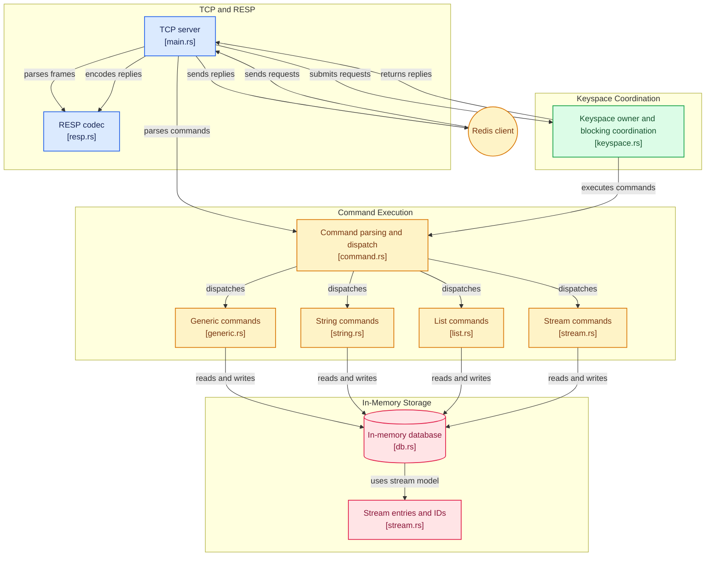

# rusty-redis

A Redis-compatible server written in Rust on top of Tokio. It speaks RESP, so
`redis-cli` and ordinary Redis client libraries can talk to it.

## Supported commands

| Group   | Commands                                                        |
|---------|-----------------------------------------------------------------|
| Generic | `PING`, `ECHO`, `DEL`, `EXISTS`, `TYPE`                         |
| Strings | `GET`, `SET` (with `EX` / `PX` expiry)                          |
| Lists   | `LPUSH`, `RPUSH`, `LPOP`, `RPOP`, `LLEN`, `LRANGE`, `LMOVE`, `BLPOP`, `BRPOP`, `BLMOVE` |
| Streams | `XADD`, `XRANGE`, `XREAD` (with `COUNT` / `BLOCK`), `XLEN`, `XDEL` |

Error messages follow real Redis byte for byte, including its quirks.

## Running

Requires Rust 1.85+ (edition 2024).

```sh
./run.sh            # or: cargo run --release
redis-cli -p 6379 ping
```

The server listens on `127.0.0.1:6379`.

## Testing

```sh
cargo test          # unit tests
./test.sh           # differential tests against a real redis-server
```

`test.sh` runs each scenario against this server (port 6379) and a real
`redis-server` (port 6380) and diffs the replies, so real Redis is the oracle.
It needs `redis-cli`, `redis-server`, `nc` and `python3`. Run `./test.sh list`
to filter by scenario name.

## Fuzzing

The RESP parser has a `cargo-fuzz` target:

```sh
cargo +nightly fuzz run parse
```

## Architecture



## Layout

```
src/
  main.rs        TCP accept loop and per-connection handling
  resp.rs        RESP parser and encoder
  command.rs     request -> Command parsing, error replies
  command/       per-group parsers (generic, string, list, stream)
  db.rs          in-memory data store and expiry
  db/stream.rs   stream entries and IDs
  keyspace.rs    single task owning the keyspace; blocking-command wakeups
fuzz/            cargo-fuzz targets
```

## Credits

- [redis-oxide](https://github.com/dpbriggs/redis-oxide), for the shape of the
  RESP parser: it first records byte offsets into the input and resolves them
  into values afterwards and each parse step returns
  `Result<Option<(usize, T)>, E>`.
- [Redis](https://github.com/redis/redis), the reference for every behavior and
  error message here and the server `test.sh` diffs against.
