# rusty-redis

A Redis-compatible server written in Rust on top of Tokio. It speaks RESP, so
`redis-cli` and ordinary Redis client libraries can talk to it. It covers
strings, lists including blocking pops, streams including blocking reads and
trimming, and transactions with `WATCH`, and it is tested by comparing every reply with a
real Redis.

## Supported commands

| Group   | Commands                                                        |
|---------|-----------------------------------------------------------------|
| Generic | `PING`, `ECHO`, `DEL`, `EXISTS`, `TYPE`                         |
| Strings | `GET`, `SET` (with `EX` / `PX` expiry), `INCR`                  |
| Lists   | `LPUSH`, `RPUSH`, `LPOP`, `RPOP`, `LLEN`, `LRANGE`, `LMOVE`, `BLPOP`, `BRPOP`, `BLMOVE` |
| Streams | `XADD` (with `NOMKSTREAM` and `MAXLEN` / `MINID` trimming), `XRANGE`, `XREAD` (with `COUNT` / `BLOCK`), `XLEN`, `XDEL`, `XTRIM` |
| Transactions | `MULTI`, `EXEC`, `DISCARD`, `WATCH`, `UNWATCH` |

Any other command gets Redis's `ERR unknown command` error.

### Differences from Redis

Replies and error messages match Redis 8.10.1 byte for byte, including its
quirks, except for these:

- **Approximate trimming** (`MAXLEN ~`, `MINID ~`) trims exactly. Redis
  removes only whole internal nodes of up to 100 entries, so it may keep more,
  and on a short stream removes nothing.
- **Inline commands** are not supported. Redis also accepts plain text lines
  such as `PING`, for typing into telnet; this server requires RESP arrays,
  which is what `redis-cli` and client libraries send.
- **Malformed input** is handled a little more strictly, and two protocol
  errors are worded differently. The two bytes after a bulk payload must be
  CRLF, where Redis skips them unchecked. CR and LF inside an echoed error are
  escaped rather than replaced by spaces. A non-bulk array element is reported
  as "expected a bulk string" rather than "expected '$', got ':'".
- **A protocol error sent while a client is blocked** is answered right after
  the blocked command's reply. Redis waits until the client next sends data.

`STRICT=1 ./test.sh` shows the first three as diffs.

### Not implemented

Other data types (hashes, sets, sorted sets), pub/sub, persistence (RDB,
AOF), replication, `AUTH` and ACLs, more than one database (`SELECT`),
keyspace commands such as `KEYS`, `DBSIZE` and `FLUSHALL`, and `--bind`: the
server listens on `127.0.0.1` only.

## Running

Requires Rust 1.88+ (edition 2024; the code uses let chains).

```sh
./run.sh            # or: cargo run --release
redis-cli -p 6379 ping
```

The server listens on `127.0.0.1:6379`; `--port <n>` changes the port. Flags
follow Redis's `--name value` style, and an unknown or malformed flag exits
with code 1.

## Testing

```sh
cargo test             # unit tests
./test.sh              # differential tests against a real redis-server
./test.sh xadd         # only scenarios whose name contains "xadd"
STRICT=1 ./test.sh     # also the documented divergences from Redis
MINE=6400 ./test.sh    # this server is on port 6400 instead of 6379
```

`test.sh` runs every scenario against this server and a real `redis-server`
and diffs the replies byte for byte. Real Redis is the oracle, so no expected
reply is written down anywhere. Start this server first, with `./run.sh` or,
if 6379 is taken, `./target/release/rusty-redis --port 6400` plus
`MINE=6400`. If nothing answers on port 6380 (`REAL`), the script starts a
throwaway `redis-server` there and stops it afterwards. A full run takes about a
minute and a half.

It needs `redis-cli`, `redis-server`, `nc`, `xxd`, `python3`, and a `timeout`
binary (`brew install coreutils` on macOS). Because error replies are compared
byte for byte, use the Redis version CI pins, 8.10.1, since other versions word
some errors differently. One scenario skips itself on macOS: Homebrew's build
of Redis compiles out an overflow check that the Linux build keeps.

CI ([ci.yml](.github/workflows/ci.yml)) builds, runs `cargo test`, and runs
the full `test.sh` on every push to `main` and every pull request, against a
`redis:8.10.1` container. Pushes that change only Markdown, `LICENSE` or
`.gitignore` skip it.

## Benchmarking

```sh
bench/bench.py                   # throughput and latency against redis-server
bench/bench.py --memory 200000   # also bytes per key, list element, stream entry
```

`bench.py` runs `redis-benchmark` with identical settings against this server
and a real `redis-server`, each in a fresh process per repeat, and reports the
median as a table of ops/s, p50 and p99 latency, and the ratio between them.
Any error reply invalidates the run, since `redis-benchmark` does not check
replies. Each run writes a report to `bench/results/` with the commit, versions
and machine. It needs `redis-server`, `redis-benchmark` and `python3`.

### Latest results

One session on an Apple M1 Pro: commit `36607be`, Redis 8.10.1, 100,000
requests per command, 50 clients, median of 3 runs. Full report:
[bench/results/2026-10-04-1803-36607be.md](bench/results/2026-10-04-1803-36607be.md).

| compared with Redis | no pipelining | 16 commands per pipeline |
|---|---|---|
| throughput, 10 commands | 0.66x to 0.80x | 0.39x to 0.97x |
| p99 latency | 0.69x to 1.18x, lower for 8 of 10 | 1.06x to 5.86x |

Treat these as approximate. An earlier run on the same machine, three days
before, measured 0.70x to 0.88x without pipelining: between the two runs this
server's throughput moved by at most 2%, while Redis's own moved by up to 24%. The 5.86x is a single `INCR` spike; the earlier run measured 2.23x.

Without pipelining, every command runs at about 104,000 ops/s whatever it
does, in both runs, which suggests the cost is in the per command round trip
rather than in the commands themselves.

| memory per item, 3 byte values | rusty-redis | Redis |
|---|---:|---:|
| string key | 287 B | 75 B |
| list element | 54 B | 7 B |
| stream entry | 196 B | 18 B |

Redis packs small values into compact encodings, while this server stores
each element as its own allocation. The stream figure is the target of the
planned storage rewrite.

## Fuzzing

The RESP parser has a `cargo-fuzz` target:

```sh
cargo +nightly fuzz run parse
```

## Architecture

```mermaid
%% Generated by https://gitdiagram.com/sdevanathan96/rusty-redis
flowchart TD

subgraph group_transport["TCP and RESP"]
  node_main["Startup and accept loop<br/>[main.rs]"]
  node_connection["Client connections<br/>[connection.rs]"]
  node_resp["RESP codec<br/>[resp.rs]"]
  node_pending["Pending requests<br/>[pending.rs]"]
end

subgraph group_execution["Command Execution"]
  node_command["Command parsing and execution<br/>[command.rs]"]
  node_args["Argument parsing<br/>[args.rs]"]
  node_errors["Command errors<br/>[error.rs]"]
  node_generic["Generic commands<br/>[generic.rs]"]
  node_strings["String commands<br/>[string.rs]"]
  node_lists["List commands<br/>[list.rs]"]
  node_streams["Stream commands<br/>[stream.rs]"]
  node_config["Server configuration<br/>[config.rs]"]
  node_integers["Strict integer parsing<br/>[int.rs]"]
end

subgraph group_coordination["Keyspace Coordination"]
  node_keyspace["Keyspace task and waiters<br/>[keyspace.rs]"]
end

subgraph group_storage["In-Memory Storage"]
  node_db[("Database and key expiry<br/>[db.rs]")]
  node_dbstrings["String storage<br/>[string.rs]"]
  node_dblists["List storage<br/>[list.rs]"]
  node_dbstreams["Stream storage<br/>[stream.rs]"]
  node_clock["Expiry clock<br/>[clock.rs]"]
end

subgraph group_transaction["Transactions"]
  node_transactions["Transaction queue<br/>[transaction.rs]"]
end

node_client(("Redis client"))

node_client -->|"connects"| node_main
node_client -->|"sends requests"| node_connection
node_main -->|"spawns clients"| node_connection
node_main -->|"reads flags"| node_config
node_connection -->|"encodes replies"| node_resp
node_connection -->|"queues parsed requests"| node_pending
node_pending -->|"parses frames"| node_resp
node_pending -->|"parses commands"| node_command
node_connection -->|"submits requests"| node_keyspace
node_keyspace -->|"executes commands"| node_command
node_command -->|"dispatches"| node_generic
node_command -->|"dispatches"| node_strings
node_command -->|"dispatches"| node_lists
node_command -->|"dispatches"| node_streams
node_command -->|"uses parsers"| node_args
node_command -->|"error replies"| node_errors
node_args -->|"parses integers"| node_integers
node_config -->|"parses numeric flags"| node_integers
node_generic -->|"reads and writes"| node_db
node_strings -->|"reads and writes"| node_db
node_lists -->|"reads and writes"| node_db
node_streams -->|"reads and writes"| node_db
node_db -->|"delegates storage"| node_dbstrings
node_db -->|"delegates storage"| node_dblists
node_db -->|"delegates storage"| node_dbstreams
node_db -->|"uses clock"| node_clock
node_connection -->|"queues MULTI commands"| node_transactions
node_transactions -->|"holds parsed items"| node_pending
node_keyspace -->|"owns database"| node_db
node_keyspace -->|"returns replies"| node_connection
node_connection -->|"sends replies"| node_client

click node_main "https://github.com/sdevanathan96/rusty-redis/blob/main/src/main.rs"
click node_connection "https://github.com/sdevanathan96/rusty-redis/blob/main/src/connection.rs"
click node_resp "https://github.com/sdevanathan96/rusty-redis/blob/main/src/resp.rs"
click node_pending "https://github.com/sdevanathan96/rusty-redis/blob/main/src/connection/pending.rs"
click node_command "https://github.com/sdevanathan96/rusty-redis/blob/main/src/command.rs"
click node_args "https://github.com/sdevanathan96/rusty-redis/blob/main/src/command/args.rs"
click node_errors "https://github.com/sdevanathan96/rusty-redis/blob/main/src/command/error.rs"
click node_generic "https://github.com/sdevanathan96/rusty-redis/blob/main/src/command/generic.rs"
click node_strings "https://github.com/sdevanathan96/rusty-redis/blob/main/src/command/string.rs"
click node_lists "https://github.com/sdevanathan96/rusty-redis/blob/main/src/command/list.rs"
click node_streams "https://github.com/sdevanathan96/rusty-redis/blob/main/src/command/stream.rs"
click node_config "https://github.com/sdevanathan96/rusty-redis/blob/main/src/config.rs"
click node_integers "https://github.com/sdevanathan96/rusty-redis/blob/main/src/int.rs"
click node_keyspace "https://github.com/sdevanathan96/rusty-redis/blob/main/src/keyspace.rs"
click node_db "https://github.com/sdevanathan96/rusty-redis/blob/main/src/db.rs"
click node_dbstrings "https://github.com/sdevanathan96/rusty-redis/blob/main/src/db/string.rs"
click node_dblists "https://github.com/sdevanathan96/rusty-redis/blob/main/src/db/list.rs"
click node_dbstreams "https://github.com/sdevanathan96/rusty-redis/blob/main/src/db/stream.rs"
click node_clock "https://github.com/sdevanathan96/rusty-redis/blob/main/src/db/clock.rs"
click node_transactions "https://github.com/sdevanathan96/rusty-redis/blob/main/src/connection/transaction.rs"

classDef toneNeutral fill:#f8fafc,stroke:#334155,stroke-width:1.5px,color:#0f172a
classDef toneBlue fill:#dbeafe,stroke:#2563eb,stroke-width:1.5px,color:#172554
classDef toneAmber fill:#fef3c7,stroke:#d97706,stroke-width:1.5px,color:#78350f
classDef toneMint fill:#dcfce7,stroke:#16a34a,stroke-width:1.5px,color:#14532d
classDef toneRose fill:#ffe4e6,stroke:#e11d48,stroke-width:1.5px,color:#881337
classDef toneIndigo fill:#e0e7ff,stroke:#4f46e5,stroke-width:1.5px,color:#312e81
classDef toneTeal fill:#ccfbf1,stroke:#0f766e,stroke-width:1.5px,color:#134e4a
class node_main,node_connection,node_resp,node_pending toneBlue
class node_command,node_args,node_errors,node_generic,node_strings,node_lists,node_streams,node_config,node_integers,node_client toneAmber
class node_keyspace toneMint
class node_db,node_dbstrings,node_dblists,node_dbstreams,node_clock toneRose
class node_transactions toneIndigo
```



## Layout

```
src/
  main.rs        startup and the TCP accept loop
  connection.rs  one client: reading, pipelining, parked waits, writing
  connection/    parsed-but-not-run queue, MULTI transaction
  config.rs      startup flags (--port)
  resp.rs        RESP parser and encoder
  int.rs         strict integer parsing, shared by commands and flags
  command.rs     request -> Command parsing, and execution
  command/       error replies, shared argument parsers, and one file per
                 command group (generic, string, list, stream)
  db.rs          in-memory data store and expiry
  db/            clocks, and each data type's storage (string, list, stream)
  keyspace.rs    single task owning the keyspace; blocking-command wakeups
  keyspace/      the WATCH table
  test_support.rs  helpers shared by the unit tests
test.sh          differential tests against redis-server
bench/           benchmark against redis-server, and its reports
fuzz/            cargo-fuzz targets
```

## Credits

- [redis-oxide](https://github.com/dpbriggs/redis-oxide), for the shape of the
  RESP parser: it first records byte offsets into the input and resolves them
  into values afterwards and each parse step returns
  `Result<Option<(usize, T)>, E>`.
- [Redis](https://github.com/redis/redis), the reference for every behavior and
  error message here and the server `test.sh` diffs against.
